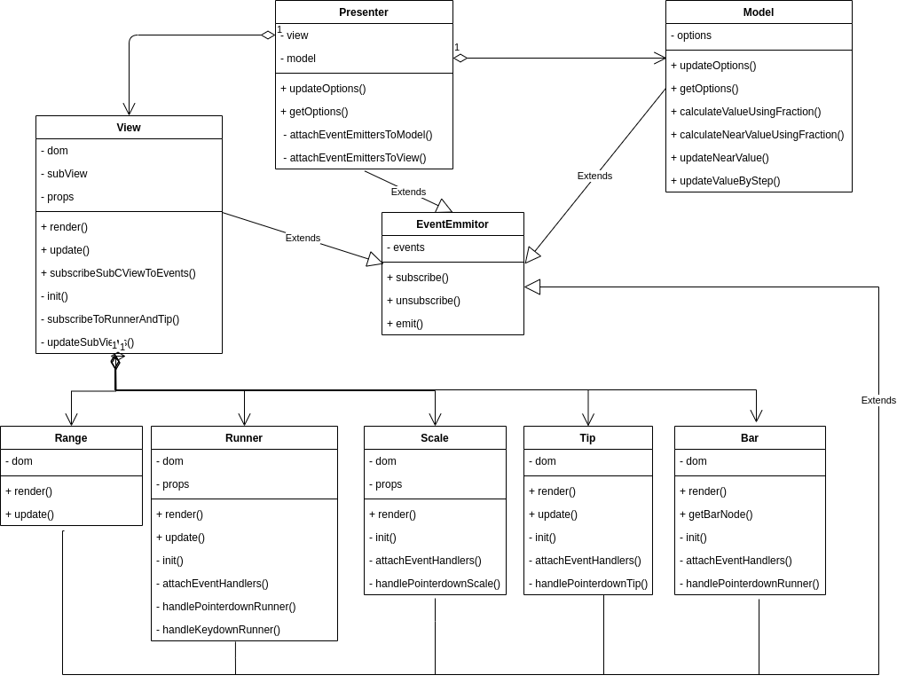

# slider-plugin

[Демо страница](https://alexioi.github.io/slider-plugin/)

## Развертывание

```bash
git clone https://github.com/Alexioi/slider-plugin.git
cd slider-plugin
npm install
npm run server
```

## Команды

| Создать prod сборку | Опубликовать билд на гитхаб страницы | Запуск всех тестов | Запуск live server | Отформатировать код |
| ------------------- | ------------------------------------ | ------------------ | ------------------ | ------------------- |
| `npm run build`     | `npm run deploy`                     | `npm run test`     | `npm run server`   | `npm run prettier`  |

## Подключение и использование

1. Для работы плагина необходимо подключить `jQuery-3.x
2. Для подключения плагина на страницу необходимо взять из папки ./dist/plugin файлы:
   - main.js
   - main.css

### Минимальный необходимый HTML

```html
<html>
  <head>
    <!--jQuery-->
    <script
      defer="defer"
      src="https://code.jquery.com/jquery-3.6.0.min.js"
    ></script>
    <!--Plugin JavaScript file-->
    <script defer="defer" src="main.js"></script>
    <!--Plugin styles file-->
    <link href="main.css" rel="stylesheet" />
    <!--Your JavaScript file-->
    <script defer="defer" src="index.js"></script>
  </head>
  <body>
    <div id="root"></div>
  </body>
</html>
```

### Минимальный необходимый JS

```javascript
// Added slider with default options
$('#root').slider();

// Added slider with custom options
$('#root').slider({
  isRange: true,
  isVertical: false,
  hasTip: true,
  hasScale: true,
  step: 10,
  min: -100,
  max: 100,
  from: -50,
  to: 40,
});
```

## Управление слайдером

Для управления слайдером необходимо его сохранить в переменную во время вызова:

```javascript
const slider = $('#root').slider();
```

Далее нужно обратиться к нужному элементу массива и использовать нужный метод **update | getOptions**

```javascript
// Method update changes option min to -900
slider[0].update({ min: -900 });

// Method getOptions returns all slider options
const sliderOptions = slider[1].getOptions();

// Method update changes custom event
slider[0].update({
  onChange: () => {
    // function body
  },
});

// Method update change format tip value
slider[0].update({
  format: (value) => {
    // function body
    // must return string
    return Strung(value * 2);
  },
});
```

## Параметры слайдера

| Опция      | Тип                       | Начальное значение               | Описание                                                        |
| ---------- | ------------------------- | -------------------------------- | --------------------------------------------------------------- |
| isRange    | boolean                   | true                             | Тип слайдера (один бегунок \| два бегунка)                      |
| isVertical | boolean                   | false                            | Вид слайдера (горизонтальный \| вертикальный)                   |
| hasTip     | boolean                   | true                             | Имеет значения над бегунками                                    |
| hasScale   | boolean                   | true                             | Имеет шкалу                                                     |
| step       | number \| 'none'          | 10                               | Шаг, при значении 'none' шаг отсутствует                        |
| min        | number                    | 0                                | Минимальное значение слайдер                                    |
| max        | number                    | 100                              | Максимальное значение слайдера                                  |
| from       | number                    | 40                               | Стартовое значения слайдера                                     |
| to         | number                    | 70                               | Конечное значения слайдера                                      |
| onChange   | (options: Options) => any | (options: Options) => {}         | Вызываемая функция при любой попытке изменить значение слайдера |
| format     | (value: number) => string | (value: number) => String(value) | Форматирует значение подсказки, должно возвращать строку        |

## Архитектура

Проект реализован по MVP-архитектуре и состоит из 3х слоев.

### Model

Содержит бизнес-логику приложения и не производить никаких расчетов, которые нужны для отображения.

### View

Не проводит никаких расчетов, относящихся к бизнес-логике. Слой содержать логику, связанную с отображением (например, для изменения положения ползунка слайдера на экране), а также реагировать на взаимодействие пользователя с приложением. Каждый компонент слайдера (бегунки, шкала и т. д.) представлен отдельным классом. Благодаря такой декомпозиции View, функционал четко разделен между subViews.

### Presenter

Этот слой имеет зависимость от других слоев. Он реагирует на сообщения от отображения о действиях пользователей и обновляет модель, а так же реагирует на сообщения об обновлении модели и обновляет отображение.

Для того, что бы модель и отображение не знали друг о друге и о призентере, они сообщают об изменениях с помощью паттерна обсервер. Презентер в свою очередь подписывается на события модели и отображения.

## UML диаграмма классов



## Зависимости

npm 8.15.0
